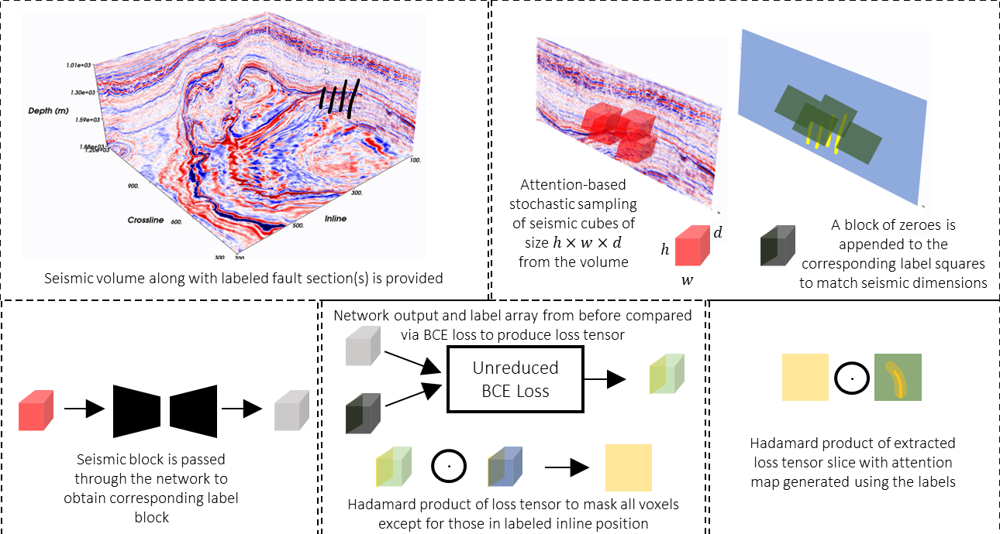

# Introduction
Accurate interpretation of visual data for relevant information forms an important component of many real-world applications such as medical disease diagnosis, geological hazard assessment, hydrocarbon exploration, etc. Producing fine-grained annotations on images is an expensive, laborious, and time-consuming process. The human brain is wired to selectively focus its attention on certain aspects of the visual scene. This perception mechanism is driven both by low-level signal cues, such as changes in color, contrast, intensity, shapes etc., as well as high-level cognitive factors such as one’s prior knowledge, goals, expectations, and constraints with respect to the task at hand. These attentional factors, referred to as bottom-up and top-down attention respectively, play an important role in determining the final annotations that get produced for a given visual scene, often at the cost of leaving out a lot of visual information the brain deems to be unimportant with regard to the task of interest. Mapping geological faults on 3D seismic volumes is one such application where human attention selectivity results in highly incomplete fault annotations. Conventional supervised learning methods treat regions of missed fault labels as negatives, resulting in non-optimal learning for the machine learning model. We propose a method to model visual attention and incorporate it into data sampling and model training procedures. We demonstrate the utility of this approach for mapping faults on seismic volumes using pretrained 3D convolutional neural networks (CNNs). Using an annotated seismic dataset from NW Australia, we show quantitatively and qualitatively that modeling visual attention leads to significant performance gains even with limited, incompletely labeled seismic training data.


# Preprint and Citation
This repository contains codes for our paper titled "Visual Attention Guided Learning 
with Incomplete Labels for Seismic Fault Interpretation". The manuscript is currently undergoing review at IEEE TGRS. 
The preprint of an earlier version of the manuscript may be accessed at https://eartharxiv.org/repository/view/5558/.

Until the full published version is available, we request that you cite the preprint in accordance with the bibtex code 
below:

```bibtex
@article{mustafa2023adaptive,
  title={Adaptive Finetuning of 3D CNNs with Interpretation Uncertainty for Seismic Fault Prediction},
  author={Mustafa, Ahmad and AlRegib, Ghassan and Rastegar, Reza},
  year={2023},
  publisher={EarthArXiv}
}
```

# Setting up the Environment and Installing Dependencies
A `requirements.txt` file is provided along with the other files in the repository. After installing anaconda, create
a new environment called `fault_interpretation`. Thereafter, install the various dependencies as described below:
```commandline
$ git clone https://github.com/olivesgatech/attention-fault-interpretation.git
$ cd attention-fault-interpretation
$ conda create --name fault_interpretation --file requirements.txt
$ conda activate fault_interpretation
```
To install PyTorch, please refer to the instructions described on the official PyTorch website [here](https://pytorch.org/get-started/locally/).

# Downloading the Data
The seismic dataset from NW Australia and its fault annotations used in the paper may be obtained [here](https://dataverse.harvard.edu/dataset.xhtml?persistentId=doi:10.7910/DVN/YBYGBK).
The data annotation procedure is described in detail in the paper found [here](https://www.sciencedirect.com/science/article/pii/S2352340921005035).

# Running the Codes
The file `train.py` contains the script required to train the 3D UNet model defined in `Networks\unet3D.py` on a sparsely annotated real seismic volume. It assumes 
that the model has already been pretrained on synthetic seismic models and associated fault labels in line with the workflow described in the paper "[FaultSeg3D: Using 
synthetic data sets to train an end-to-end convolutional neural network for 3D seismic fault segmentation](https://library.seg.org/doi/abs/10.1190/geo2018-0646.1?journalCode=gpysa7)".
You may also refer to the official GitHub repository related to the paper [here](https://github.com/xinwucwp/faultSeg). 
We are currently not able to provide the pretrained network we developed for proprietary reasons.

If using your own seismic volume, the seismic volume should be annotated along the first dimension. For example, 
if a seismic volume was annotated inline by inline, the dimensions of the numpy array should be ordered as inlines x crosslines x time. Time should be the last dimension.
The label volume containing fault annotations needs to be of the same dimensionality. One may create the label volume by adding blocks of zeros to all places not annotated 
by interpreters for the purpose of finetuning the network. One may then carry out finetuning by running the script as 

```commandline
python train.py -i <path/to/seismic/volume> -l <path/to/label/volume> -m <path/to/network/trained/weights/file> -o <path/to
output/finetuned/model/weights/file> -or 2 0 1 -d False -w 128 -n 200 -e 25
```
You may obtain a list of the argument used by the script and their respective definitions by running 

```commandline
python train.py -h
```

During inference, one may use the model finetuned earlier by running 

```commandline
python inference.py -i <path/to/seismic/volume> -or 2 0 1 -m <path/to/trained/network/weights> -o <path/to/results/directory> 
-d False -w 128 -p True
```

You may look up the argument definitions by running 
```commandline
python inference.py -h
```
Make sure to input the seismic volume with dimensions ordered in the same way as it was input to the training script before. 

# Troubleshooting
Here are some common pitfalls that may result in the code not giving you expected results.
1. Please make sure your network was pretrained well and can actually pick faults with high accuracy on synthetic test samples.
2. Make sure you are loading the seismic volume and its labels in the correct manner as described above. 
3. Increase the number of finetuning epochs and the number of cubes sampled every iteration for training
4. During inference, make sure you load the seismic volume in the correct orientation and in the same manner as during finetuning. 
5. Use the same window size and decimation settings for finetuning and inference i.e., if finetuning on undecimated volume, 
keep the volume undecimated during inference. 

# Questions
For any questions or concerns, please reach out to the corresponding author Ahmad Mustafa at ahmadmustafa.am@gmail.com.
Alternatively, you may also open an issue and we will follow up on it. 
